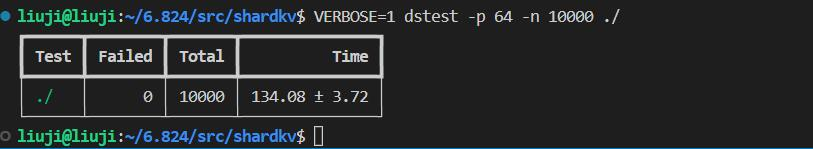

### lab 2A
* rand electiontimeout
* votedFor = -1, if reply's term greater than currentTerm

### lab 2B
* disconnect, leader election increment term, back and leader changed, same term, apply wrong log
* 

### lab 2C
* accelebrate log backtracking, border case
* log {1, 2, 3}, log{1, 2, 3, 4, 5} reply order, update nextIndex wrong
* turn to follower, votedfor = -1
* replicate log unit = throught up to leader's newest log entry

### lab 2D
* deadlock, caused by snapshot, 
* If commitIndex > lastApplied: increment lastApplied, applylog[lastApplied] to state machine
* test code snapshot in for operation of channel, if apply log in a for loop. cause deadlock
* start a backgroud goroute apply logs (lastApplied, commitIndex]
* doesn't need to wait sendAppendEntries, just send and carefully treat reply, detect this bug because after reconnect, time costs very high
* persist Snapshot attributes only when snapshot
* snapshot doesn't work with applylog together

### others
* applychan in critcial zone, cause deadlock 
* infinite loop result in deadlock

lab 3A
* basic test, client doesn't check reply, need retry put append operation if reply.success == false, fixed
* deadlock start agreement could fail(leader change), it's not good to use cond.wait, never wakeup, use periodly check found this bug by monitor applych
* applyCh, decouple
* leader change, return quickly and retry another server
* deadlock, kv startagreement to raft, might fail, cond.wait never wake up, solution: periodlly broadcast all cond
* at most once req

lab 3B
* duplicate log entry in raft
* follower snapshot index might > leader snapshot, it's ok
* follower lose update and became leader, missing element. cause: snapshot apply use the same channel as log apply, carefully deal with order
* beacause of latency, kvserver read snapshot whose snapshot index > kvserver's commitedIndex

lab 4A
* rebalance should be determinstic, stable sort matters a lot
* operation result should be deterministic

lab 4B
* periodly query latest shard config, update config using raft
* fail & recovery, updateconfig conflict deadlock with bring kvserver back, when fail, raft replay its log iteself, bring kvsever back 
* update config: compute kv state it should be then make agreement using raft,  otherwise fail & recovery may deadlock
* rpc args should be a copy of original data, if rpc retry, won't suffer from descent modification(better not modify, use another copy)
* migrate shard to another group's leader, leader fail, unable to get these shards, use pull config rather than push
* a server shutdowned as a leader, update config(staled) as soon as stand up, read snapshot and catch up, leader fail, this server elected as leader again, keep update staled config, blocked
* caculate outshards kv map and shard kv map before arrive at agreement is evil, because server could be shutdowned, but read by next group, server read snapshot and come back, a shard could be servered by two group, which is not allowed
* using raft make agreement on config, but follower/leader pull shards independently is evil in the presence of leader fail
* concurrently pull shards speed up reconfiguration
* put/append operation success on a group, but fail to reply to client before this group migrate this shard out, client try another group, do one operation twice
* wake up by broadcastall and found not success while in real world it's success, descent request should be treat as duplicate
* request R try A group shard-a, A group fail, A group restart, new Config, A migrate out shard-a, group B receive shard-a, and successfully complete request R, but because of latency, B pullshards from A more than once, ClientInfo may be overwrited, and make confuse to client, client try more, an operation could be done twice or more, be carefull to merge ClientInfo
* when restart and replay raft log, new request may be wake up wrongly, be careful
* modify raft, if snapshot index == lastSnapshotincludedindex, still snapshot, because of garbage collection
* when snapshot, save raftstate and snapshotstate atomicly (snapshot 135, fail and start up but readsnapshot 131, because it's non-atomic and lose (132 133 134 135) overwrite by readsnapshot 131 update 1/5000) atomic problem is hard to detect, though I pass lab 2D 2000 times
* notify applylog goroutine when receive snapshot
